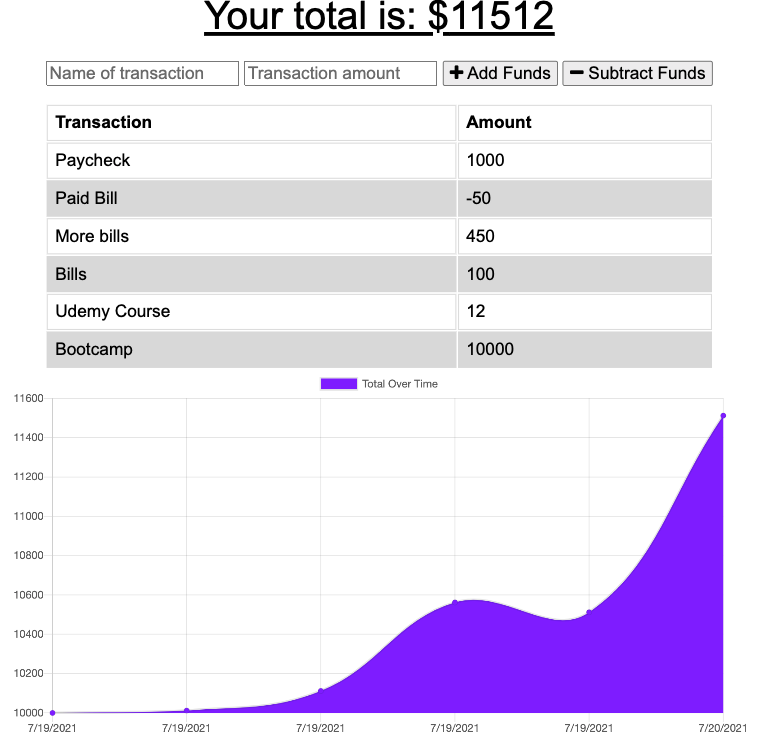

# PWA-Budget-Tracker

# Table of Contents

- [Description](#description)
- [Installation](#installation)
- [Usage](#usage)
- [Contributing](#contributing)
- [Test](#test)
- [License](#license)
- [Issues](#issues)
- [Questions](#questions)

## Description:

This app was made with HTML, CSS, JavaScript, MongoDB, Mongoose, Express, and Node.js.  It also uses IndexedDB, webmanifest, and a service-worker.js file to allow for offline updates that automatically update when the user is back online.

[Link to Deployed App](https://frozen-brook-42657.herokuapp.com/)

## Installation:
n/a

## Usage:
Used to track the transaction history of the user and display it in a graphical format in the UI. This application was made as a Progressive Web App so that offline entries would be stored in the indexedDB and posted to the MongoDB once the user re-establishes their online connection.

## Contributing:
Please submit a pull request.  For large changes please email me first.

## Test: 
n/a

## License:
For more information about the License, click on the link below.

## Issues:
N/A

- [License](https://opensource.org/licenses/ISC)

##  Questions:
For questions about the app you can go to my 
Github page at the following link:

- [Github Profile](https://github.com/abalcs)

For additional questions please reach out to me via email at: abalcom23@gmail.com.